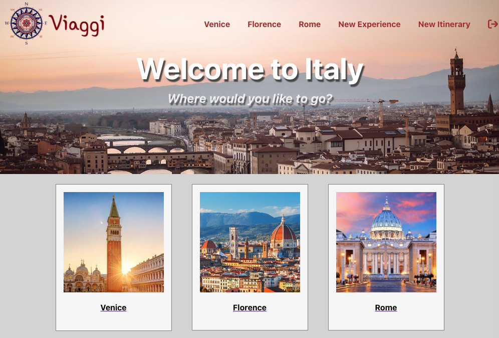

# Viaggi

## [OPEN SITE HERE](https://viagggi.netlify.app/)

### Welcome to Viaggi! Create your perfect vacation by adding user created experiences into your very own itinerary!

### Contributors:
- [Pablo Villeda-Echverria](https://github.com/pablove123)
- [Alex Jones](https://github.com/alexanderjones1)
- [Kevin Harrington](https://github.com/kevinharr)

#### Technologies Used 💻
- React
- Node.js
- Express
- Mongoose
- Fly.io
- Netlify
- MongoDB
- JavaScript
- HTML 
- CSS

#### Resources 💾
- Adobe Photoshop
- Adobe Illustrator
- Font Awesome
- DK Travel 

#### Ice Box 🧊
- [ ] Add Search Function
- [ ] Add More Cities
- [ ] Make it mobile friendly
- [ ] View other users itinerary
- [ ] Able to add a schedule in each itinerary
- [ ] Make it mobile friendly

##### [Planning materials](https://trello.com/b/FvL3FGa1/unit-3)
##### [Backend Github](https://github.com/pablove123/Viaggi-backend)
